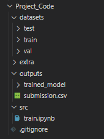

# EE4483 Mini Project (Cats & Dogs)
## Project by MeiTong Lew, Clifford Eng & JunZe Siew

1. Git clone this repository 
```
git clone https://github.com/Junszz/ai_project
```

2. Place the dataset into this folder following this structure


3. Make sure to install all the necessary dependencies

4. Execute all cell blocks and observe the results

5. The trained model will be save at `outputs/trained_model`
```
checkpoint = torch.load("../outputs/trained_model/checpoint_epoch_9.pt")
```

6. Change the checkpoint name to load the specific model checkpoint